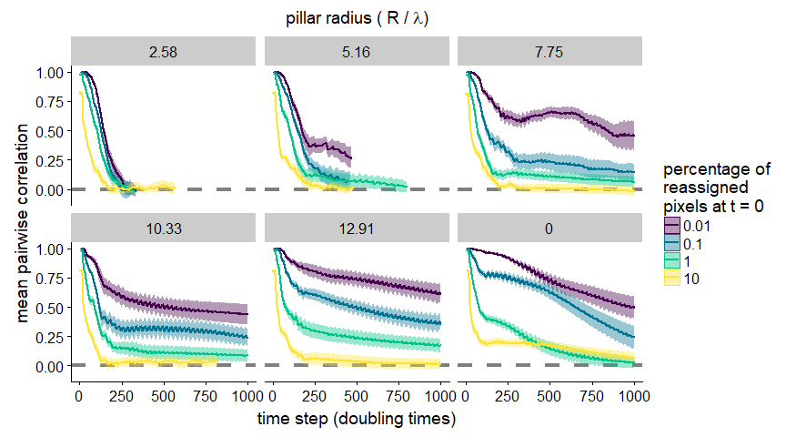

Figure 4 - Decorrelation time and chaos
================
Nick Lowery

Background
==========

This script generates Figure 4 from our preprint:
**Structured environments fundamentally alter dynamics and stability of ecological communities**
<https://www.biorxiv.org/content/early/2018/07/10/366559>

It shows that the more densely packed pillars are in the simulation environment, replicate simulations decorrelate more rapidly and become more sensitive to smaller perturbations in the initial conditions - i.e. pillars induce chatoic fluctuations within simulated communities.

First, load the requisite libraries

``` r
library(R.matlab)
library(tidyverse)
library(cowplot)
library(colorspace)
```

Wrangle raw data files
----------------------

The following code chunk reads in the raw .mat files and writes organized flat .csv data files. It's not run here, but included for clarity.

``` r
# read in raw data files
chaos.corr.raw <- list.files("/path/to/files", pattern = ".mat", full.names = T) %>%
  lapply(., readMat)

chaos.metadata.raw <- list.files("/path/to/files", pattern = ".mat", full.names = T) %>%
  lapply(., readMat)

# organize into tbl
chaos.corr <- chaos.corr.raw %>% {
  tibble(
    L = map_dbl(., "L"),
    R = map_dbl(., "R"),
    dx = map_dbl(., "dx"),
    dinit = map_dbl(., "dinit"),
    cor.mat = map(., "cor.mat"),
    cor.mean = map(., "cor.mean"),
    cor.sd = map(., "cor.sd")
  )
} %>%
  filter(dinit %in% c(0.1, 0.01, 0.001, 0.0001)) %>%
  select(-cor.mat) %>%
  unnest() %>%
  group_by(R, dx, dinit) %>%
  mutate(t.step = seq_along(cor.mean))

chaos.metadata <- chaos.metadata.raw %>% {
  tibble(
    P = map_dbl(., "P"),
    pillars = map_dbl(., "pillarq"),
    R = map_dbl(., "R"),
    dx = map_dbl(., "dx"),
    dinit = map_dbl(., "dinit"),
    rep = map_dbl(., "rep"),
    data = map(., `[`, c("meanA.out", "meanB.out", "meanC.out")) %>% map(data.frame)
  )
} %>%
  unnest() %>%
  rename(A = meanA.out, B = meanB.out, C = meanC.out) %>%
  group_by(R, dx, dinit, rep) %>%
  mutate(t.step = seq_along(A))

# write organized data files
write_csv(chaos.corr, "3sp_chaos_corr.csv")
write_csv(chaos.metadata, "3sp_chaos_metadata.csv")
```

Calculate time to extinction
============================

We'll use the flat data files for the rest of the analysis. We'll also need a file that gives the number of pillar vs. non-pillar pixels in each simulation environment, to accurately determine when extinctions occur (see below).

``` r
chaos.corr <- read_csv("3sp_chaos_corr.csv")
chaos.metadata <- read_csv("3sp_chaos_metadata.csv")
pillar.weights <- read_csv("filt_all_weights.csv", col_names = c("L","R","dx","pillar.weight")) %>%
  mutate(dx = round(dx*R))
```

Now, we'll calculate whether a simulation went extinct, and if so at which time step. Extinction is defined as any species abundance falling below a minimum threshold (specifically, the area that could be pinned between a pillar and the edge of the simulation box, and thereby not in contact with the rest of the simulation environment).

``` r
chaos.ext <- chaos.metadata %>%
  left_join(pillar.weights) %>%
  mutate(extinct = ifelse(A <= ((2*R)^2 - pi*R^2)/4/pillar.weight |
                          B <= ((2*R)^2 - pi*R^2)/4/pillar.weight |
                          C <= ((2*R)^2 - pi*R^2)/4/pillar.weight , 1, 0)) %>%
  group_by(R,dx,dinit,rep) %>%
  summarise(extinction = max(extinct),
            t.extinct = ifelse(max(extinct), which.max(extinct), NA)) %>%
  group_by(R,dx,dinit) %>%
  summarise(t.stop = floor(min(t.extinct, na.rm = T)/5)) # round to whole time step
    # this will generate a bunch of warnings when nothing goes extinct, which are safe to ignore
```

Next is to combine the extinction data with the between-rep correlation data, and prep for plotting:

``` r
chaos.corr.plot <- chaos.corr %>%
  ungroup() %>%
  left_join(chaos.ext) %>%
  filter(t.step <= t.stop) %>% 
  mutate(R = round(R/sqrt(15), digits = 2),
         R = fct_relevel(factor(R), "0", after = Inf),
         dinit = 100*dinit)
```

Generate Plot
=============

Before making the final plot, I'm using the following function from the colorspace package to generate the color palette for this (and other) plots. Full disclosure: I almost always use the colorspace GUI to pick the palettes I want.

``` r
pal <- function (n, h = c(300, 75), c. = c(35, 95), l = c(15, 90), 
                 power = c(0.8, 1.2), fixup = TRUE, gamma = NULL, alpha = 1, 
                 ...) 
  {
  if (!is.null(gamma)) 
    warning("'gamma' is deprecated and has no effect")
  if (n < 1L) 
    return(character(0L))
  h <- rep(h, length.out = 2L)
  c <- rep(c., length.out = 2L)
  l <- rep(l, length.out = 2L)
  power <- rep(power, length.out = 2L)
  rval <- seq(1, 0, length = n)
  rval <- hex(polarLUV(L = l[2L] - diff(l) * rval^power[2L], 
                       C = c[2L] - diff(c) * rval^power[1L], H = h[2L] - diff(h) * 
                         rval), fixup = fixup, ...)
  if (!missing(alpha)) {
    alpha <- pmax(pmin(alpha, 1), 0)
    alpha <- format(as.hexmode(round(alpha * 255 + 1e-04)), 
                    width = 2L, upper.case = TRUE)
    rval <- paste(rval, alpha, sep = "")
  }
  return(rval)
}
```

And, finally, the code to generate the plot:

``` r
chaos.corr.plot %>%
  ggplot(aes(x = t.step, y = cor.mean, color = as.factor(dinit), group = dinit)) +
  geom_hline(yintercept = 0, linetype = "dashed", size = 1.5, color = "grey50") +
  geom_ribbon(aes(ymin = cor.mean - cor.sd/sqrt(10), 
                  ymax = cor.mean + cor.sd/sqrt(10), 
                  fill = as.factor(dinit), color = NULL), alpha = 0.4) +
  geom_line(size = 1, lineend = "round") +
  facet_wrap(~ R) +
  scale_color_manual(values = pal(4)) +
  scale_fill_manual(values = pal(4)) +
  labs(x = "time step (doubling times)",
       y = "mean pairwise correlation",
       color = paste("percentage of","reassigned","pixels at t = 0", sep = "\n"),
       fill = paste("percentage of","reassigned","pixels at t = 0", sep = "\n"),
       title = expression(paste("pillar radius ( R / ", lambda, ")"))) +
  theme(plot.title = element_text(size = 14, face = "plain"))
```


